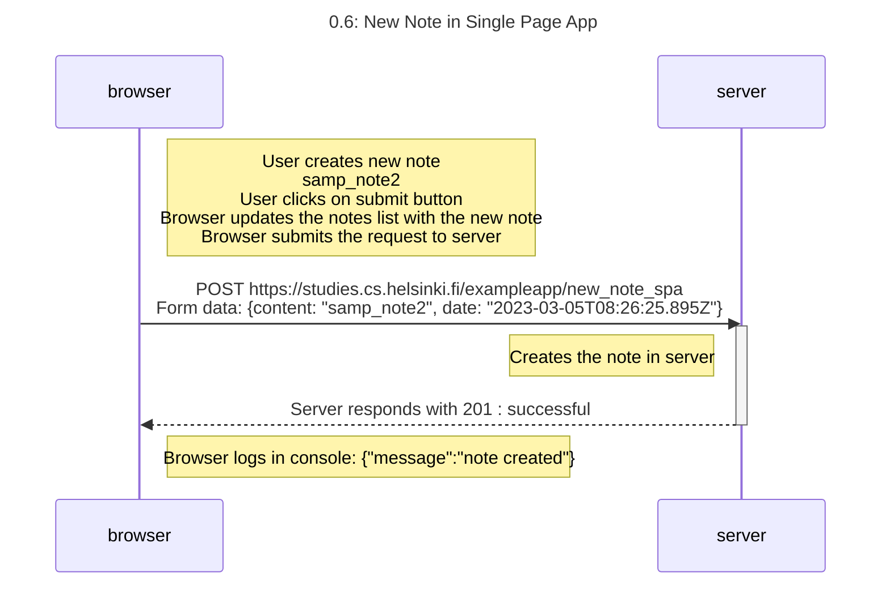

```mermaid
sequenceDiagram
    Title: 0.6: New Note in Single Page App
    participant browser
    participant server
    
    Note right of browser: User creates new note <br> samp_note2 <br> User clicks on submit button <br> Browser updates the notes list with the new note <br> Browser submits the request to server

    browser->>server: POST https://studies.cs.helsinki.fi/exampleapp/new_note_spa <br> Form data: {content: "samp_note2", date: "2023-03-05T08:26:25.895Z"}
    activate server
    Note left of server: Creates the note in server
    server-->>browser: Server responds with 201 : successful
    deactivate server
    
    Note right of browser: Browser logs in console: {"message":"note created"}
```